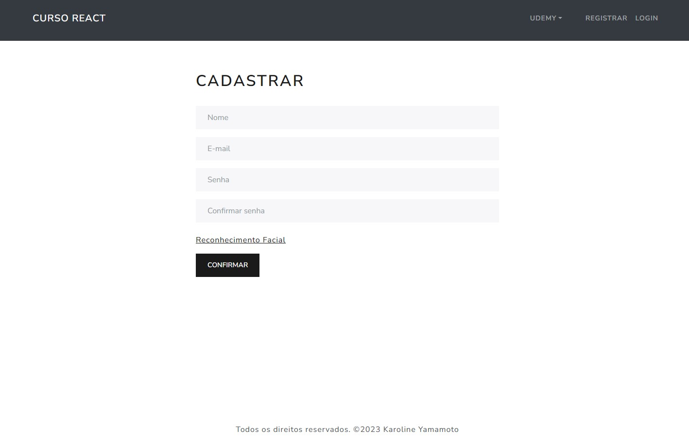
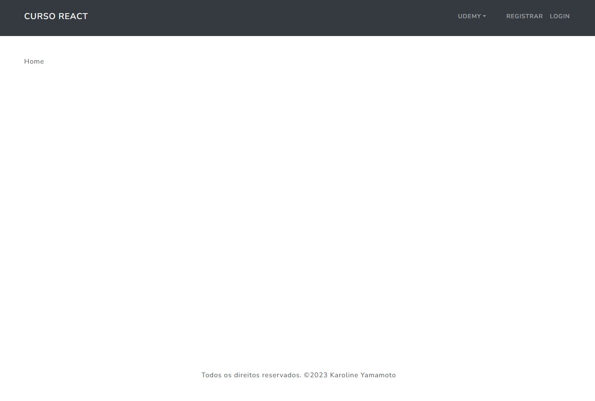
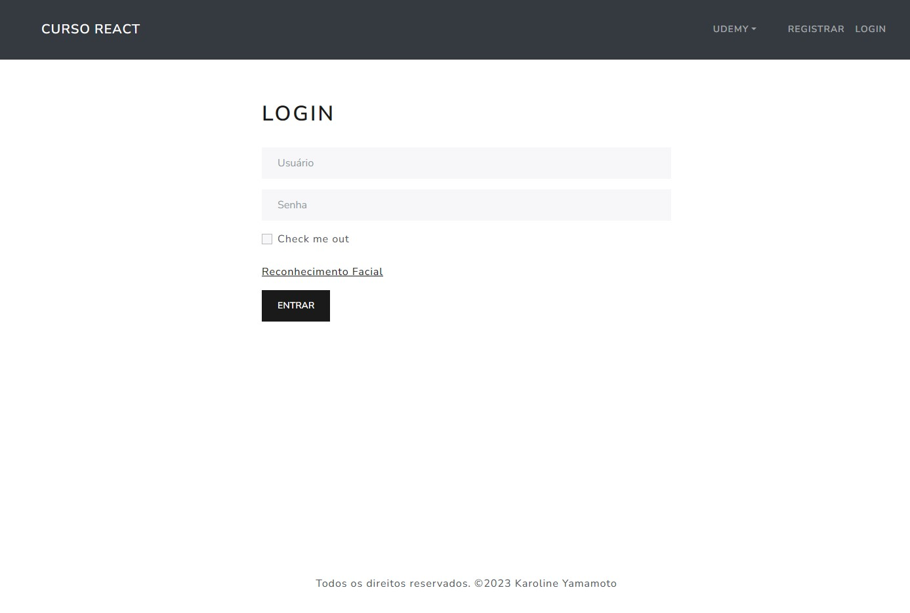

<h1 align="center"> React Course  </h1>

<p align="center">
   Registration of React course.
</p>

<p align="center">
  <a href="#-technologies">Technologies</a>&nbsp;&nbsp;&nbsp;|&nbsp;&nbsp;&nbsp;
  <a href="#-project">Project</a>&nbsp;&nbsp;&nbsp;|&nbsp;&nbsp;&nbsp;
  <a href="#-references">References</a>&nbsp;&nbsp;&nbsp;|&nbsp;&nbsp;&nbsp;
  <a href="#memo-licence">Licence</a>
</p>

<p align="center">
  
</p>

<br>

npm install -D jest jest-environment-jsdom @testing-library/jest-dom @testing-library/react @testing-library/user-event
npm i bootstrap react-boostrap
npm i --save-dev @types/styled-components
npm i axios
npm i @fortawesome/react-fontawesome @fortawesome/free-solid-svg-icons


## Template

<p align="center">
    
</p>
<p align="center">
    
</p>
<p align="center">
    
</p>

## 🚀 Technologies

This project was developed with the following technologies:

- [Vite](https://vitejs.dev/)
- [Typescript](https://www.typescriptlang.org/)

## 💻 Project

Project - Login and Registration Form Front-end opening the webcam for facial recognition built with typescript.

## When I create
```bash
npm create vite@latest vite-revo-form --template react-ts
npm i react-router-dom
npm install @stitches/react
npm install styled-components
npm install @types/styled-components
npm i react-bootstrap
npm i react-webcam
```

## Installation

```bash
$ npm install
```

## Running the app

```bash
# development
$ npm run dev
```

Links Usefull:
<p align="left"> VSCode Download -  https://code.visualstudio.com/download</p>
<p align="left"> Git Download -  https://git-scm.com/download/win</p>

## 🔖 References

Vite Guide
https://vitejs.dev/guide/

## :memo: Licence

This project is under the MIT license.

---

Made with ♥ by Karoline :wave: [Let's program together!](https://www.linkedin.com/in/karoline-hikari-yamamoto/)


